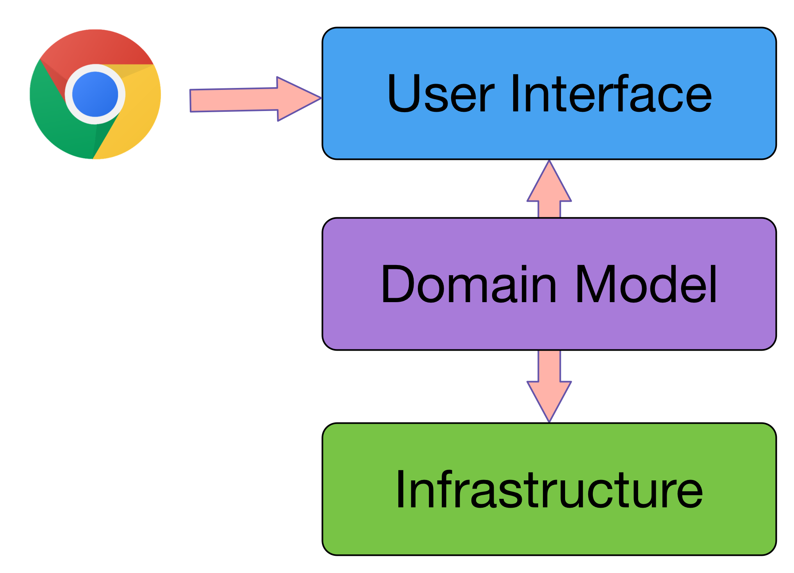
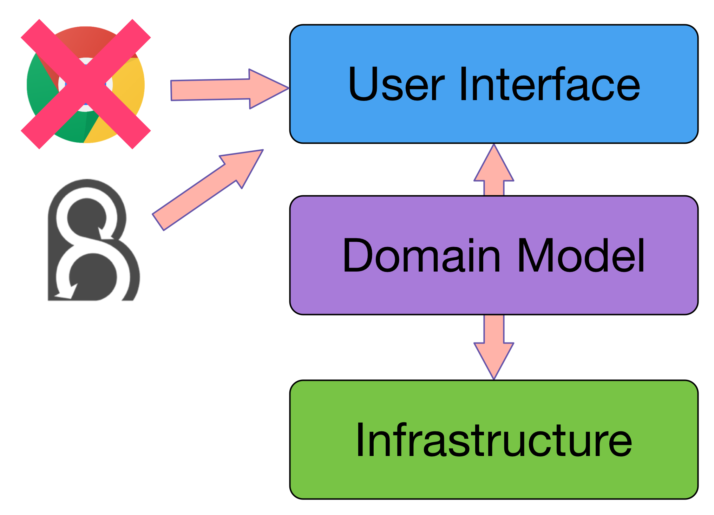
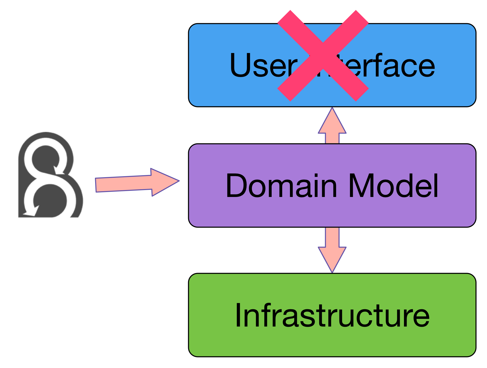
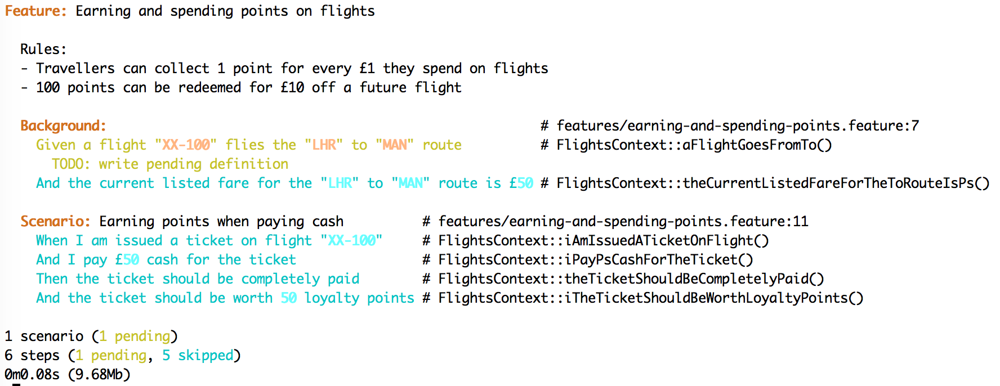
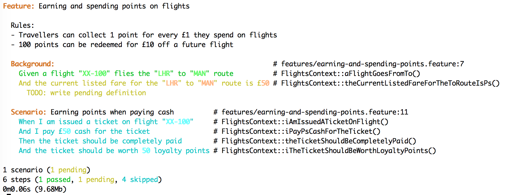
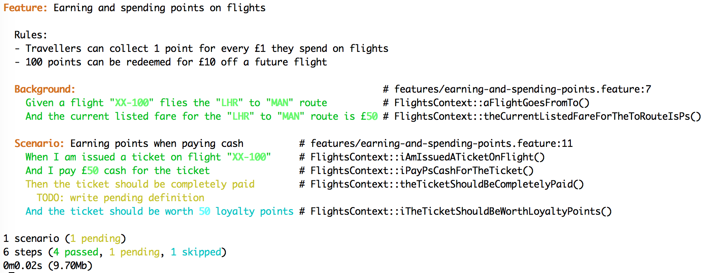
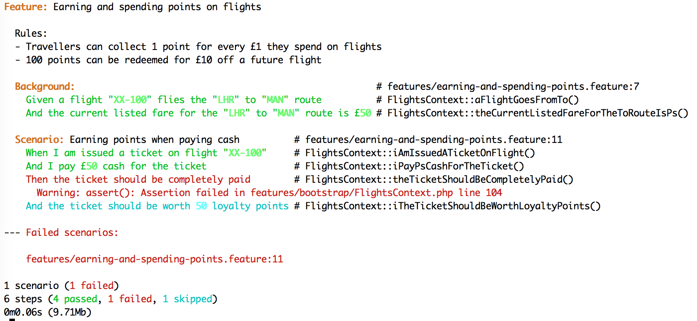
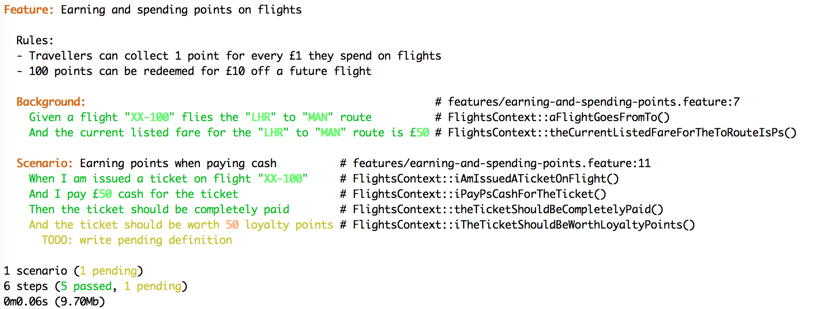
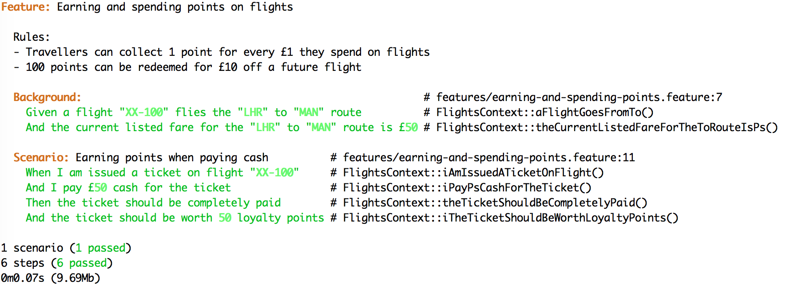

# [fit] Driving Design through Examples
## [fit] **Ciaran McNulty at London BDD Meetup**

---

# Modelling by Example
## **Combining BDD and DDD concepts**

---

# **B**ehaviour **D**riven **D**evelopment

---

> BDD is the art of using examples in conversations to illustrate behaviour
 -- Liz Keogh


---

# Why **Examples**?

---

# Requirements as Rules

We are starting a new budget airline flying between London and Manchester

- Travellers can collect **1** point for every **£1** they spend on flights
- **100** points can be redeemed for **£10** off a future flight
- Flights are taxed at **20%**

---

# Rules are **Ambiguous**

---

# Ambiguity

- When redeeming points do I still earn points?
- Can I redeem more than 100 points on one flight?
- Does tax apply to the discounted fare or the full fare?

---

# Examples are **Unambiguous**

---

# Examples

If a flight from London to Manchester costs **£50**:

* If you pay cash it will cost **£50** + **£10** tax, and you will earn **50** new points
* If you pay entirely with points it will cost **500 points** + **£10** tax and you will earn **0** new points
* If you pay with **100** points it will cost **100 points** + **£40** + **£10** tax and you will earn **0** new points

---

# Examples are **Objectively Testable**

---

# **Gherkin**
## A formal language for examples


---

```gherkin
Feature: Earning and spending points on flights

  Rules:
    - Travellers can collect 1 point for every £1 they spend on flights
    - 100 points can be redeemed for £10 off a future flight

  Scenario: Earning points when paying cash
    Given ...

  Scenario: Redeeming points for a discount on a flight
    Given ...

  Scenario: Paying for a flight entirely using points
    Given ...

```

---

# Gherkin steps

* **Given** sets up context for a behaviour
* **When** specifies some action
* **Then** specifies some outcome

Action + Outcome = Behaviour

---

```gherkin

Scenario: Earning points when paying cash
  Given a flight costs £50
  When I pay with cash
  Then I should pay £50 for the flight
  And I should pay £10 tax
  And I should get 50 points

Scenario: Redeeming points for a discount on a flight
  Given a flight costs £50
  When I pay with cash plus 100 points
  Then I should pay £40 for the flight
  And I should pay £10 tax
  And I should pay 100 points

Scenario: Paying for a flight entirely using points
  Given a flight costs £50
  When I pay with points only
  Then I should pay £0 for the flight
  And I should pay £10 tax
  And I should pay 500 points

```

---

# Who writes examples?

**Business** expert
**Testing** expert
**Development** expert

All discussing the feature together


---

# When to write scenarios

* **Before** you start work on the feature
* Not **too long** before!
* Whenever you have access to the **right people**

---

# Refining scenarios

* When would this outcome **not** be true?
* What **other** outcomes are there?
* But what would happen **if**...?
* Does this **implementation detail** matter?

---

# **Scenarios** are not *Contracts*


---

# Scenarios

* Create a **shared understanding** of a feature
* Give a starting definition of **done**
* Provide an objective indication of **how to test** a feature

---

# **D**omain **D**riven **D**esign

---

> DDD tackles complexity by focusing the team's attention on knowledge of the domain
-- Eric Evans


---

# [fit] Invest time in
# [fit] **understanding** 
# [fit] the business 

---

# Ubiquitous Language

* A **shared** way of speaking about domain concepts
* Reduces the **cost of translation** when business and development communicate
* Try to establish and use **terms the business will understand**

---

# **M**odelling **b**y **E**xample

---

> By embedding Ubiquitous Language in your scenarios, your scenarios naturally become your domain model
-- Konstantin Kudryashov (@everzet)


---

# Principles

* The best way to **understand the domain** is by **discussing examples**
* Write scenarios that **capture ubiquitous language**
* Write scenarios that **illustrate real situations**
* **Directly drive the code model** from those examples

---

# **Directly** driving code with Behat?

---

# Layered architecture



---

# UI testing with Behat



---

# UI tests

* Slow to execute
* Brittle
* Don't let you think about the code

---

# Test the domain first



---

```gherkin

Scenario: Earning points when paying cash
  Given a flight costs £50
  When I pay with cash
  Then I should pay £50 for the flight
  And I should pay £10 tax
  And I should get 50 points

Scenario: Redeeming points for a discount on a flight
  Given a flight costs £50
  When I pay with cash plus 100 points
  Then I should pay £40 for the flight
  And I should pay £10 tax
  And I should pay 100 points

Scenario: Paying for a flight entirely using points
  Given a flight costs £50
  When I pay with points only
  Then I should pay £0 for the flight
  And I should pay £10 tax
  And I should pay 500 points

```

---

# Add **realistic** details

---

```gherkin

Background:
  Given a flight from "London" to "Manchester" costs £50

Scenario: Earning points when paying cash
  When I fly from "London" to "Manchester"
  And I pay with cash
  Then I should pay £50 for the flight
  And I should pay £10 tax
  And I should get 50 points

```

---

# **Actively seek** terms from the domain

---

* What words do you use to talk about these things?
* Points? Paying? Cash Fly?
* Is the cost really attached to a flight?
* Do you call this thing "tax"?
* **How do you think about these things**?

---

# Get good at listening

---

```gherkin

  Background:
    Given a flight "XX-100" flies the "LHR" to "MAN" route
    And the current listed fare for the "LHR" to "MAN" route is £50

  Scenario: Earning points when paying cash
    When I am issued a ticket on flight "XX-100"
    And I pay £50 cash for the ticket
    Then the ticket should be completely paid
    And the ticket should be worth 50 loyalty points

```

---

# Lessons from the conversation

* **Price** belongs to a **Fare** for a specific **Route**
* **Flight** is independently assigned to a **Route**
* Some sort of fare listing system controls Fares
* I get quoted a cost at the point I purchase a ticket

**This is really useful to know!**

---

# Driving the domain model with **Behat**

---

# Configure a Behat suite

```
default:
    suites:
        core: 
            contexts: [ FlightsContext ]
```

---

# Create a context

```php
class FlightsContext implements Context
{
    /**
     * @Given a flight :arg1 flies the :arg2 to :arg3 route
     */
    public function aFlightFliesTheRoute($arg1, $arg2, $arg3)
    {
        throw new PendingException();
    }

    // ...
}

```

---

# Run Behat



---

# Model values as **Value Objects**

---

```php
class FlightsContext implements Context
{
    /**
     * @Given a flight :flightnumber flies the :origin to :destination route
     */
    public function aFlightFliesTheRoute($flightnumber, $origin, $destination)
    {
        $this->flight = new Flight(
            FlightNumber::fromString($flightnumber),
            Route::between(
                Airport::fromCode($origin),
                Airport::fromCode($destination)
            )
        );
    }

    // ...
}
```

---

# Transformations

```php
/**
 * @Transform :flightnumber
 */
public function transformFlightNumber($number)
{
    return FlightNumber::fromString($number);
}

/**
 * @Transform :origin
 * @Transform :destination
 */
public function transformAirport($code)
{
    return Airport::fromCode($code);
}
```

---

```php
/**
 * @Given a flight :flightnumber flies the :origin to :destination route
 */
public function aFlightFliesTheRoute(
    FlightNumber $flightnumber,
    Airport $origin,
    Airport $destination
)
{
    $this->flight = new Flight(
        $flightnumber, Route::between($origin, $destination)
    );
}
```

---

```
> vendor/bin/behat
PHP Fatal error:  Class 'Flight' not found 
```

---

# Describe **objects** with **PhpSpec**

---

```php
class AirportSpec extends ObjectBehavior
{
    function it_can_be_represented_as_a_string()
    {
        $this->beConstructedFromCode('LHR');
        $this->asCode()->shouldReturn('LHR');
    }

    function it_cannot_be_created_with_invalid_code()
    {
        $this->beConstructedFromCode('1234566XXX');
        $this->shouldThrow(\Exception::class)->duringInstantiation();
    }
}
```

---

```php

class Airport
{
    private $code;

    private function __construct($code)
    {
        if (!preg_match('/^[A-Z]{3}$/', $code)) {
            throw new \InvalidArgumentException('Code is not valid');
        }

        $this->code = $code;
    }

    public static function fromCode($code)
    {
        return new Airport($code);
    }

    public function asCode()
    {
        return $this->code;
    }
}

```

---



---

```php
/**
 * @Given the current listed fare for the :arg1 to :arg2 route is £:arg3
 */
public function theCurrentListedFareForTheToRouteIsPs($arg1, $arg2, $arg3)
{
    throw new PendingException();
}
```

---

# [fit] Model **boundaries** 
# [fit] with **Interfaces**

---

```php

interface FareList
{
    public function listFare(Route $route, Fare $fare);
}
```

---

# Create in-memory versions for testing

```php
namespace Fake;

class FareList implements \FareList
{
    private $fares = [];

    public function listFare(\Route $route, \Fare $fare)
    {
        $this->fares[$route->asString()] = $fare;
    }
}

```

---

```php

/**
 * @Given the current listed fare for the :origin to :destination route is £:fare
 */
public function theCurrentListedFareForTheToRouteIsPs(
    Airport $origin,
    Airport $destination,
    Fare $fare
)
{
    $this->fareList = new Fake\FareList();
    $this->fareList->listFare(
        Route::between($origin, $destination),
        Fare::fromString($fare)
    );
}
```

---

# Run Behat


---

```php
/**
 * @When Iam issued a ticket on flight :arg1
 */
public function iAmIssuedATicketOnFlight($arg1)
{
    throw new PendingException();
}
```

---

```php
/**
 * @When I am issued a ticket on flight :flight
 */
public function iAmIssuedATicketOnFlight()
{
    $ticketIssuer = new TicketIssuer($this->fareList);
    $this->ticket = $ticketIssuer->issueOn($this->flight);
}
```

---

```
> vendor/bin/behat
PHP Fatal error:  Class 'TicketIssuer' not found 
```

---

```php
class TicketIssuerSpec extends ObjectBehavior
{
    function it_can_issue_a_ticket_for_a_flight(\Flight $flight)
    {
        $this->issueOn($flight)->shouldHaveType(\Ticket::class);
    }
}
```


---

```php
class TicketIssuer
{
    public function issueOn(Flight $flight)
    {
        return Ticket::costing(Fare::fromString('10000.00'));
    }
}

```
---

# Run Behat


---


```php
/**
 * @When I pay £:fare cash for the ticket
 */
public function iPayPsCashForTheTicket(Fare $fare)
{
    $this->ticket->pay($fare);
}
```
---

```
PHP Fatal error:  Call to undefined method Ticket::pay()
```

---

```php
class TicketSpec extends ObjectBehavior
{
    function it_can_be_paid()
    {
        $this->pay(\Fare::fromString("10.00"));
    }
}
```

---

```php
class Ticket
{
    public function pay(Fare $fare)
    {
    }
}
```

---

# Run Behat



---

# [fit] The model will be
# [fit] **anaemic**
# [fit] Until you get to **Then**

---

```php
/**
 * @Then the ticket should be completely paid
 */
public function theTicketShouldBeCompletelyPaid()
{
    throw new PendingException();
}
```

---

```php
/**
 * @Then the ticket should be completely paid
 */
public function theTicketShouldBeCompletelyPaid()
{
    assert($this->ticket->isCompletelyPaid() == true);
}
```

---

```
PHP Fatal error:  Call to undefined method Ticket::isCompletelyPaid()
```

---

```php
class TicketSpec extends ObjectBehavior
{
    function let()
    {
        $this->beConstructedCosting(\Fare::fromString("50.00"));
    }

    function it_is_not_completely_paid_initially()
    {
        $this->shouldNotBeCompletelyPaid();
    }

    function it_can_be_paid_completely()
    {
        $this->pay(\Fare::fromString("50.00"));

        $this->shouldBeCompletelyPaid();
    }
}

```

---

```php

class Ticket
{
    private $fare;

    // ...

    public function pay(Fare $fare)
    {
        $this->fare = $this->fare->deduct($fare);
    }

    public function isCompletelyPaid()
    {
        return $this->fare->isZero();
    }
}
```

---

```php
class FareSpec extends ObjectBehavior
{
    function let()
    {
        $this->beConstructedFromString('100.00');
    }

    function it_can_deduct_an_amount()
    {
        $this->deduct(\Fare::fromString('10'))->shouldBeLike(\Fare::fromString('90.00'));
    }
}
```

---

```php 
class Fare
{
    private $pence;

    private function __construct($pence)
    {
        $this->pence = $pence;
    }

    // ...

    public function deduct(Fare $amount)
    {
        return new Fare($this->pence - $amount->pence);
    }
}
```

---

```php

class FareSpec extends ObjectBehavior
{
    // ...

    function it_knows_when_it_is_zero()
    {
        $this->beConstructedFromString('0.00');
        $this->shouldBeZero();
    }

    function it_is_not_zero_when_it_has_a_value()
    {
        $this->beConstructedFromString('10.00');
        $this->shouldNotBeZero();
    }
}
```

---

```php
class Fare
{
    private $pence;

    private function __construct($pence)
    {
        $this->pence = $pence;
    }

    // ...

    public function isZero()
    {
        return $this->pence == 0;
    }
}
```

---

# Run Behat



---

```php
class TicketIssuerSpec extends ObjectBehavior
{
    function it_issues_a_ticket_with_the_correct_fare(\FareList $fareList)
    {
        $route = Route::between(Airport::fromCode('LHR'), Airport::fromCode('MAN'));
        $flight = new Flight(FlightNumber::fromString('XX001'), $route);

        $fareList->findFareFor($route)->willReturn(Fare::fromString('50'));

        $this->beConstructedWith($fareList);

        $this->issueOn($flight)->shouldBeLike(Ticket::costing(Fare::fromString('50')));
    }
}
```

---

```php

class TicketIssuer
{
    private $fareList;

    public function __construct(FareList $fareList)
    {
        $this->fareList = $fareList;
    }

    public function issueOn(Flight $flight)
    {
       return Ticket::costing($this->fareList->findFareFor($flight->getRoute()));
    }
}
```

---

```php
interface FareList
{
    public function listFare(Route $route, Fare $fare);

    public function findFareFor(Route $route);
}
```

---

```php
class FareList implements \FareList
{
    private $fares = [];

    public function listFare(\Route $route, \Fare $fare)
    {
        $this->fares[$route->asString()] = $fare;
    }

    public function findFareFor(\Route $route)
    {
        return $this->fares[$route->asString()];
    }
}
```

---

# Run Behat



---

```php
/**
 * @Then I the ticket should be worth :points loyalty points
 */
public function iTheTicketShouldBeWorthLoyaltyPoints(Points $points)
{
    assert($this->ticket->getPoints() == $points);
}
```

---

```php
class FareSpec extends ObjectBehavior
{
    function let()
    {
        $this->beConstructedFromString('100.00');
    }

    // ...

    function it_calculates_points()
    {
        $this->getPoints()->shouldBeLike(\Points::fromString('100'));
    }
}

```

---

```php
class TicketSpec extends ObjectBehavior
{
    function let()
    {
        $this->beConstructedCosting(\Fare::fromString("100.00"));
    }

    // ...

    function it_gets_points_from_original_fare()
    {
        $this->pay(\Fare::fromString("50"));
        $this->getPoints()->shouldBeLike(\Points::fromString('100'));
    }
}

```

---

```php
<?php

class Ticket
{
    private $revenueFare;
    private $fare;

    private function __construct(Fare $fare)
    {
        $this->revenueFare = $fare;
        $this->fare = $fare;
    }

    // ...

    public function getPoints()
    {
        return $this->revenueFare->getPoints();
    }
}

```

---

# Run Behat



---

# Where is our domain model?

---

```gherkin
Feature: Earning and spending points on flights

  Rules:
  - Travellers can collect 1 point for every £1 they spend on flights
  - 100 points can be redeemed for £10 off a future flight

  Background:
    Given a flight "XX-100" flies the "LHR" to "MAN" route
    And the current listed fare for the "LHR" to "MAN" route is £50

  Scenario: Earning points when paying cash
    When I am issued a ticket on flight "XX-100"
    And I pay £50 cash for the ticket
    Then the ticket should be completely paid
    And I the ticket should be worth 50 loyalty points
```

---

```
> bin/phpspec run -f pretty

      Airport

  10  ✔ can be represented as a string
  16  ✔ cannot be created with invalid code

      Fare

  15  ✔ can deduct an amount
  20  ✔ knows when it is zero
  26  ✔ is not zero when it has a value
  31  ✔ calculates points

      FlightNumber

  10  ✔ can be represented as a string

      Flight

  13  ✔ exposes route

      Points

  10  ✔ is constructed from string

      Route

  12  ✔ has a string representation

      TicketIssuer

  16  ✔ issues a ticket with the correct fare

      Ticket

  15  ✔ is not completely paid initially
  20  ✔ is not paid completely if it is partly paid
  27  ✔ can be paid completely
  34  ✔ gets points from original fare
```

---
 
# **UI** Testing

---

# With the domain already modelled

* UI tests do not have to be comprehensive
* Can focus on intractions and UX
* Actual UI code is easier to write!

---

```
default:
    suites:
        core: 
            contexts: [ FlightsContext ]
        web: 
            contexts: [ WebFlightsContext ]
            filters: { tags: @ui }
```

---

Feature: Earning and spending points on flights

  Scenario: Earning points when paying cash
    Given ...

  @ui
  Scenario: Redeeming points for a discount on a flight
    Given ...

  Scenario: Paying for a flight entirely using points
    Given ...


---

# Modelling by Example

* Focuses attention on **use cases**
* Helps developers **understand** core business domains
* Encourages **layered architecture**
* Speeds up test suites

---

# Use it when

* Project is core to your business
* You are likely to support business changes in future
* You can have conversations with stakeholders

---

# Do not use when...

* **Not core** to the business
* Prototype or short-term project
* It can be **thrown away** when the business changes
* You have no access to business experts (but try and change this)

---

# Thank you!

* **@ciaranmcnulty**
* Lead Maintainer of **PhpSpec**
* **Senior Trainer** at:
  Inviqa / Sensio Labs UK / Session Digital / iKOS

# Questions?
